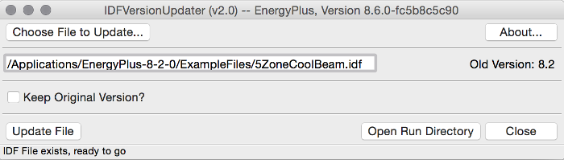

Welcome to IDFVersionUpdater's documentation!
=============================================

The purpose of this program is to enable EnergyPlus users to transition up their existing input files to the latest version of EnergyPlus.
This program itself is EnergyPlus-version-agnostic, and currently will transition input files up to the latest version found installed in this machine in the default location.

--------------------------
Packaging and Installation
--------------------------

The program is built by `Travis CI <https://travis-ci.org>`_ and packaged using `py2app <https://pythonhosted.org/py2app/>`_ to create a Mac-compatible program package.
This package can then be *installed* onto the machine by placing it into the ``/Applications`` directory so that it can be launched via Spotlight or other means.

-----------------
Using the Program
-----------------

Launching the program reveals the following main window:

This main window reveals a lot of information.

* The window title bar shows the program version, as well as the highest detected version of EnergyPlus installed on the system

* The top row of the window includes buttons to allow selection of an input file, and show the ``About...`` dialog with additional information about the program

* The next row has a user-editable file path text entry, and a label showing the entered file version:

  * The text entry is populated when using the file selection dialog, although the user can enter a file path manually as well

  * Whenever a file is selected, the contents of the file is parsed to detect the existing file version and that version is shown on the label

  * The available actions on the window vary based on whether a valid file path is entered in the text box

* The next row allows the user to select whether to keep a copy of the original file in the run directory or allow it to be overwritten during transition

* The next row includes the main action buttons:

  * ``Update`` will run the transition utilities to get the file up to the latest version, running multiple transitions as needed

  * ``Open Run Directory`` opens the run directory to allow inspection of the transition files at any time

  * ``Close`` obviously closes the program

* The status bar shows updates during the program operation, including running each transition and when the whole transition is complete or if there was a failure

-------------------------
Source Code Documentation
-------------------------

Documentation of the source code, pretty much only important for the developers, is available for the following modules.

.. toctree::
   :maxdepth: 2

   EnergyPlusPath
   IDFVersionUpdater
   International
   TransitionBinary
   TransitionRunThread

Indices and tables
==================

* :ref:`genindex`
* :ref:`modindex`
* :ref:`search`

